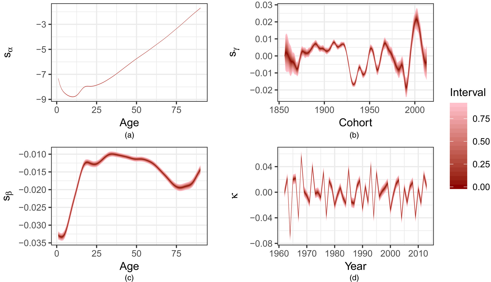
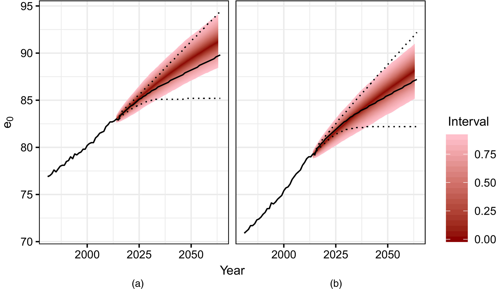

class: inverse, middle, center

# Forecasting frontier mortality with generalised additive models

.large[
Joint work with:


**Erengul Dodd, Jon Forster, Jakub Bijak, Peter W.F. Smith**
]

Funding:
ESRC Centre for Population Change Phase II and T

The use of the Iridis 3 HPC cluster is gratefully acknowledged

```{r setup, include=FALSE}
library(rmarkdown)
library(knitr)
knitr::opts_chunk$set(echo = FALSE, message=F, warning=F)
knitr::opts_chunk$set(dev = "png",fig.height=8, fig.width=12)

library(ggplot2)
library(dplyr)
library(magrittr)
library(tidyr)
library(rstan)
library(scales)
library(tibble)
library(ggfan)
library(purrr)
library(ggfan)
library(here)
prefix <- params$prefix

# sometimes we might want results elsewhere (eg X:)
results_prefix <- file.path(here(), "results")

theme_set(theme_bw(base_size = 20))

source(file.path(here(), "R", "reconstruct.R"))
source(file.path(here(), "R", "data_functions.R"))
#source(file.path(here(), "R", "utilities.R"))


```

---
# Motivations

Forecasts of population mortality have a wide range of important applications in government and the private sector.

- Pension policy

- Health care planning

- Life Insurance and annuity pricing


--
- As inputs to population forecasts, which in turn inform:
  + Housing decisions
  + Local development plans
  + Business planning (innovation, marketing)


---
# What properties should a forecast have?

- **Accuracy:** 
  + We want mortality estimates to be close to true values


--
- **Quantified Uncertainty:** 
  + A range of possible values provides for risk management (Keilman 2002, Bijak et al. 2015)
  + Combined with a cost function, this allows formal decision analysis tools to be used


--
- **Make use of all sources of information**
  + Existing (prior) knowledge about regularities in mortality may constrain models
  + Information about trends in other countries may be informative about current mortality


  
--
This paper will describe a probabilistic model for mortality forecasting that incorporates information about the long run change in *frontier mortality* into forecasts


---
# Mortality Forecasting - Previous Work


__Projecting UK mortality by using Bayesian generalized additive models__


__Model description__

$$log(\mu_{xt}) = \color{red}{s_{\alpha}(x)} + \color{blue}{s_{\beta}(x)}t +\color{purple}{s_{\gamma}(t-x)} +\color{orange}{\kappa_t}$$

- Log-mortality $\mu_{xt}$ is a sum of smooth functions of <span style="color:red"> age </span> and <span style="color:purple">cohort</span>, a set of smooth age-specific <span style="color:blue">mortality improvements</span>

- Additional <span style="color:orange">period </span> effects $\kappa$ capturing trend deviations (e.g. flu outbreaks), modelled as a random walk

- Transition from a GAM based model to a parametric logistic model at older ages where data is more sparse

- Smooth functions modelled using penalised B-splines

- Constrains on period and cohort terms are needed for identifiability

---
# Components - Female




---
# Life Expectancy





---
class: inverse, middle, center


# Frontier Mortality

---
# Best practice life-expectancy

The seminal paper by Oeppen and Vaupel (2002) identifies a long-run linear trend in "best-practice" (period) life expectancy.


--
- Best practice is defined as the highest life expectancy globally.

- The sustainability of this linear trend was the subject of much debate (e.g. Olshanskly et al 2001)

- Oeppen and Vaupel showed that previously suggested limits to life expectancy tended to be breached not long after they were proposed.


---
# Why a linear trend?

Exactly why this linear trend should exist is debated. 

- Oeppen and Vaupel (2002) describe a “regular stream of continuing progress” resulting from a “intricate interplay of advances in income, salubrity, nutrition, eduction, sanitation, and medicine”(p. 1029)


--
- Theoretical work has identified possible processes:
  + Continuous re-investment of the proceeds of economic growth (Oeppen 2019)
  + Bengtsson (2019) suggests countries best practice life-expectancy may 
  experience slower growth, as they cannot 'borrow' techniques from more advanced neighbours


--
- Life expectancy in a particular period is the result of aggregation of mortality from many cohorts
  + Mortality experience is affected by the long-term experience of cohorts, not just by current events
  + Change is expected to be slow and steady


--
Some theoretical explanations, although we cannot be sure that linear change will continue.


---
# Existing work
Other work has attempted to make use of frontier mortality:


- Bijak (2004) assumed long-term convergence towards frontier life expectancy


- Torri and Vaupel (2012) modelled frontier life expectancy and the gap between this and country values using log-transform


- Pascariu, Canudas-Romo and Vaupel (2018) employed a two-gap model to include males and ensure forecast coherence


- Ebeling (2018) fitted smooth 2-d splines to mortality rate surfaces to identify the location of minimum mortality


---
# Life expectancy or mortality?
  
Lee and Carter (1992) and Tuljapurkar, Li, and Boe (2000) identify linear trends in log-mortality, rather than life expectancy, at country level.


--
Life expectancy is a non-linear function of the underlying mortality rates.

- Vaupel and Canudas (2003) show that change in life expectancy is a weighted sum of age-specific mortality improvements.
  + Weights change depending on the level of mortality
  + Linear improvements in mortality *constant across age* will result in linear life expectancy increases (Keyfitz 1977)


--
- Aburto et al. (2020) show these weights become more concentrated at older ages as mortality declines.


--
Linear change in mortality rates generally imply slightly decelerating growth in life expectancy. 

- This is seen to some extent in the data (Lee 2019)


---
class: inverse, middle, center


# Descriptive Analysis


---
# Exploration

We wish to use trends in frontier mortality to inform a forecasting model

- We assume greater stability in the frontier than in country-specific mortality

- Do we observe linear trends in frontier mortality?


--
### Data
Data from Human Mortality Database from across the developed world provide the opportunity to jointly model the frontier and individual country rates


--
- Nineteen countries with reasonable population sizes and data going back to 1961 are chosen.


- Female data only
  + Men are unlikely to contribute to the frontier given their higher mortality


---
# Definitions

### Central Mortality Rate

$$m_{xt} = \frac{D_{xt}}{R_{xt}},$$ 
- $D_{xt}$ denotes the number of deaths of individuals aged between $x$ and $x+1$ during year $t$, 
- $R_{xt}$ is the exposure to risk during of the same group over that period, measured in terms of person-years lived.


### Mortality Frontier

The best (lowest) mortality rate at each year and age amongst all countries:

$$m_{xt}^{*} = \text{min}_c(m_{xtc}),$$ where $c$ indicates a particular country.


---
# Empirical Patterns in Frontier Log-Mortality

```{r mortimp}
emp_rate_df <- readRDS(file.path(here(), "data", "rate.rds"))

countries <- emp_rate_df %>% select(Country) %>% unique() %>%
 unlist() 
front_mort <- emp_rate_df %>% group_by(Year,Age) %>% filter(Age<91) %>%
  summarise(`Log rate`=min(Log_rate)) %>% ungroup() %>% mutate(year=as.factor(Year))

ages <- c(1,30,50,70,90)
front_mort %>% filter(Age %in% ages,
                      Year >1960, Year <=2016) %>%
  ggplot(aes(x=Year,y=`Log rate`, colour=Age)) + 
  geom_point(size=3) +
  facet_grid(Age~., scales="free")  +
  geom_smooth(method = lm) -> p

print(p)

```


---
# Country contributions to the frontier


```{r countries, fig.cap="Counts of country contributions to empirical frontier mortality by age group. Human Mortality Database"}
emp_rate_df %>% filter(Year>=1961, Year<=2016) %>% 
  group_by(Year,Age) %>% filter(Age<91) %>%
    filter(Log_rate==min(Log_rate)) %>% 
  mutate(`Age group`=paste0((Age %/% 20)*20, " - ", (Age %/% 20 + 1)*20)) %>%
  ggplot(aes(x=Country, fill=`Age group`)) + geom_histogram(stat="count", colour="black") +
  coord_flip()
  

```


---
class: inverse, middle, center


# Modelling Frontier Mortality

---
# Model structure


### Likelihood
$$D_{xtc} \sim \text{Negative Binomial}(m_{xtc}R_{xtc}, \; \text{exp}(\phi))$$


### Log-Rate Model

- The <span style="color:red">mortality frontier</span> is modelled using smooth age and improvement terms.

- Country rates incorporate <span style="color:blue">positive deviations</span> from frontier mortality.

- Additional <span style="color:purple">country-specific period effects</span> capture year to  year variation

$$\text{log}(m_{xtc}) = \color{red}{s_{\mu}(x) + s_{\beta}(x)t} + \color{blue}{s_{\gamma}^{c}(x)\text{exp}(h(x,t))} + \color{purple}{\kappa_{tc}}$$


---
# Model specification
The frontier model shares elements with previous work


- Smooth age-specific pattern of mortality
- Smooth age-specific mortality improvements

The country-specific element is constrained to be positive


- The coefficients on the age pattern of country-specific deviations $s_\gamma^c(x)$ are forced to be positive
- This ensures the frontier lies below all country specific surfaces
- Different choices possible for $h(x,t)$ function describing time evolution of deviations


---
# Model specification 
Without further priors and constraints, the model is unidentified, as the frontier could lie anywhere below the country specific rates


- Coefficients on country-specific deviations are penalised so that smaller 
values are favoured
  + Double exponential priors on the the deviations $s_\gamma^c(x)$

- Period effects are constrained to sum to zero and have zero linear and quadratic components

- In addition, standard smoothness penalties are employed for all spline coefficients

- Linear and quadratic age-specific functions are trialled for $h(x,t)$


> Full details given in the manuscript


--
### Estimation

Stan software was used to obtain posterior samples from the model.


---
class: inverse, middle, center


# Results


---
# Results - Country-Specific Deviations

```{r frontierpost, fig.cap="Posterior distribution of frontier mortality, selected years. Plotted data points represent all observations in a given year; colours denote countries.", fig.height=10, fig.width=10}

results <- readRDS(file.path(results_prefix, 
                             params$quad_ts,
                             "mort_pacer_quad_2006.rds"))
                            
stan_data <- results$stan_data
mort_fit <- results$mort_fit

frontier_df <- get_frontier_mortality(stan_data, mort_fit) %>% 
  rename(`Log rate`=Log_rate)
# 
# years <- c(1961, 1980, 2000, 2016)
# ggplot(frontier_df %>% filter(Year %in% years), 
#        aes(x=Age,y=`Log rate`)) + 
#   facet_wrap(~Year) +
#   geom_point(data=emp_rate_df %>% filter(Year %in% years) %>% 
#                rename(`Log rate`=Log_rate), 
#              aes(colour=Country),show.legend = FALSE,
#              size=0.5) + 
#   geom_interval()


```

```{r countryintercept, fig.cap="Posterior distribution of country-specific deviations at the intercept of the time index for selected countries"}
countries <- stan_data$country_decode %>% 
  arrange(country_f) %>% select(Country) %>% unlist()


country_intercept <- map_df(countries, 
                            function(country) { 
                              get_country_intercept(stan_data, 
                                                    mort_fit, 
                                                    country) %>%
                                mutate(Country=country)})

plot_countries <- c("GBRTENW", "JPN", "NOR", "FRATNP")
ggplot(country_intercept %>% filter(Country %in% plot_countries), 
       aes(x=Age, y=Deviation)) + 
  geom_interval(aes(quantile=Quantile)) +
  facet_wrap(~Country)

```
---
# Posterior Estimates - Quadratic Model

```{R post}
nb_rate_df <- get_nb_log_rate_df(stan_data, mort_fit, emp_rate_df, "GBRTENW")

plot_rate_df <- rbind(nb_rate_df %>% 
                        mutate(Type="Posterior Rate") %>%
                        rename(`Log rate`=Log_rate),
                      frontier_df %>%
                        mutate(Type="Frontier"))
                        
ages <- c(50,70,90)

ggplot(plot_rate_df %>% filter( Age %in% ages),
       aes(x=Year,y=`Log rate`, colour=Type)) + 
  geom_interval(aes(quantile=Quantile, group=Type), intervals = c(0,0.9)) +
  facet_grid(Age~., scales="free") +
  geom_vline(xintercept=stan_data$config$joy) + 
  geom_point(data=emp_rate_df %>% filter(Age %in% ages,
                                         Year>= stan_data$config$start_year,
                                         Country=="GBRTENW") %>%
               rename(`Log rate`=Log_rate),
             col="red") 
```


---
class: inverse, middle, center


# Conclusion


---
# Evaluation

The suitability of the model was tested using held back observations from 2007-2016. 

- RMSE was used of as the metric of comparison

Linear and quadratic models were compared to the simpler model below, fitted to each country independently:

$$\text{log}(m_{xt}) = s_{\mu}(x) + s_{\beta}(x)t + k_t$$


--
The quadratic model showed modest performance improvements versus this 'independence' model.

- Lower RMSE in 13 out of 19 countries

---
# Evaluation


### Strenths

- Combining information across countries allows robust estimates of smooth mortality frontier
- Country-specific mortality estimated jointly with the frontier
- Assumptions about frontier avoids extrapolations of recent steep declines indefinitely
- Individual countries can catch up or fall away from the frontier

### Limitations

- Quadratic model can lead to problematic extrapolations
- Assumption of linear frontier change
- Frontier estimates dependent on choice of countries in the data


---
# Future work

### Country-specific elements

Greater flexibility required in country-specific trends:

- Lee-Carter model 
- Currie model (2-dimensional spline)

These will also provide for more sensible long-term extrapolations.

### Frontier elements

Identifying change-points in development of the frontier (more speculative)


### Extensions

Double-gap two sex model (Pascariu et al. 2018)


---
# Covid implications

The majority of this work was conducted before COVID. 


--
How to incorporate the pandemic into long term forecasting models is an open question.

For the model described above:
- The $\kappa_tc$ terms will absorb some of the effect of the pandemic, although this will increase uncertainty going forward
- The pandemic could be captured by allowing a one-off effect capturing the mortality spike in 2020 and 2021
  + Country specific timings are an issue here

--
The long-term effects of pandemic are unclear:
- 'Harvesting' effects may reduce mortality in the short-term
- Will mutant variants of COVID persist in the population following vaccination programmes?
- Long-term effect of COVID on the health of those who where infected remains uncertain
  + Will 'Long Covid' and related disease affect health in the long term?
- Optimistically, COVID may spur further investments in the health system


---
# Published Work

Dodd, E., Forster, J. J., Bijak, J., & Smith, P. W. F. (2018). Smoothing mortality data: the English Life Tables , 2010-2012. *Journal of the Royal Statistical Society: Series A (Statistics in Society)*, 181(3), 717–735. https://doi.org/10.1111/rssa.12309

Hilton, J., Dodd, E., Forster, J., & Smith, P. W. F. (2019). Projecting UK Mortality using Bayesian Generalised Additive Models. *Journal of the Royal Statistical Society. Series C*, 68(1), 29–49. https://doi.org/10.1111/rssc.12299


Hilton, J., Dodd, E., Smith, P. W. F., & Forster, J. J. (Forthcoming).
Modelling frontier mortality using Bayesian Generalised Additive Models. 

Code available via github:[https://github.com/jasonhilton/frontier_mort](https://github.com/jasonhilton/frontier_mort)

Manuscript: [https://github.com/jasonhilton/frontier_mort/raw/master/paper/mort_pacer.pdf](https://github.com/jasonhilton/frontier_mort/raw/master/paper/mort_pacer.pdf)


---
# References

.small[

Aburto, J. M., Villavicencio, F., Basellini, U., Kjærgaard, S., & Vaupel, J. W. (2020). Dynamics of life expectancy and life span equality. Proceedings of the National Academy of Sciences of the United States of America, 117(10), 5250–5259. https://doi.org/10.1073/pnas.1915884117

Bengtsson, T. & N. Keilman (Eds.) (2019), Old and New Perspectives on Mortality Forecasting (pp. 167–183). Springer Open. https://doi.org/10.1007/978-3-030-05075-7_14 (*Replication of booklets from 2000s*)


Bergeron-Boucher, M. P., Canudas-Romo, V., Pascariu, M., & Lindahl-Jacobsen, R. (2018). Modeling and forecasting sex differences in mortality: a sex-ratio approach. Genus, 74(1). https://doi.org/10.1186/s41118-018-0044-8

Oeppen, J., & Vaupel, J. W. (2002). Broken Limits to Life Expectancy. Science, 296(5570), 1029–1031. https://doi.org/10.1126/science.1069675

Pascariu, M. D., Canudas-Romo, V., & Vaupel, J. W. (2018). The double-gap life expectancy forecasting model. Insurance: Mathematics and Economics, 78(2018), 339–350. https://doi.org/10.1016/j.insmatheco.2017.09.011


Torri, T., & Vaupel, J. W. (2012). Forecasting life expectancy in an international context. International Journal of Forecasting, 28(2), 519–531. https://doi.org/10.1016/j.ijforecast.2011.01.009

]


---
class: inverse, middle, center


# Thank you!


.small[
This work was supported by the ESRC Centre for Population Change - phase II (grant ES/K007394/1) at the University of Southampton. The use of the IRIDIS High Performance Computing Facility, and associated support services at the University of Southampton, in the completion of this work is also acknowledged. All the views presented in this paper are those of the authors only.
]